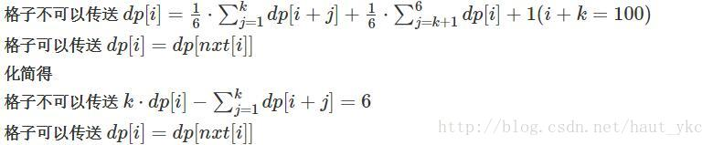

#Gauss消元+概率dp
```c++
/*
------------------
设dp[i][j]为(i,j)到最下面一行的期望
这样f[x][y]就可以直接得出答案
[事实上,很多数学期望DP都会采取倒推的方式执行]
有:M=1/4*(L+M+R+D)+1  <==>  1/4*L+1/4*R-3/4*M=-1/4*D-1
具体实现过程:对每一行列一套方程,高斯消元,
[把D当做已知数]  <==  最下面一行就结束!所以这样倒推
可以发现,每一个方程都只有两个或三个数,可以打特定的消元操作解决问题,所以一套高斯消元可以做到O(M),整个时间复杂度为O(N*M)
细节见代码
------------------2019.1.5
*/
#pragma GCC optimize(2)
#include<bits/stdc++.h>
#define Max(x,y) ((x)>(y)?(x):(y))
#define Min(x,y) ((x)<(y)?(x):(y))
using namespace std;
typedef long long LL;
const int INF=1e9+7;
inline LL read(){
    register LL x=0,f=1;register char c=getchar();
    while(c<48||c>57){if(c=='-')f=-1;c=getchar();}
    while(c>=48&&c<=57)x=(x<<3)+(x<<1)+(c&15),c=getchar();
    return f*x;
}

const int MAXN=1005;

double a[MAXN][MAXN],dp[MAXN];
int n,m,x,y;

inline void build(){
    if(m==1){
        a[1][1]=-1.0/2;//因为特殊点是1和m,所以当m=1时需要特判,每一行只有两种情况
        a[1][m+1]=-dp[1]/2-1;
        return;
    }
    a[1][1]=-2.0/3;//小数除法2.0/3
    a[1][2]=1.0/3;
    a[1][m+1]=-dp[1]/3-1;
    for(int i=2;i<m;i++){
        a[i][i-1]=1.0/4;
        a[i][i]=-3.0/4;
        a[i][i+1]=1.0/4;
        a[i][m+1]=-dp[i]/4-1;//a[i][m+1]项放常数项,一般是很有用的
    }
    a[m][m-1]=1.0/3;
    a[m][m]=-2.0/3;
    a[m][m+1]=-dp[m]/3-1;
}

inline void gauss(){
    for(int i=1;i<m;i++){
        double x=a[i+1][i]/a[i][i];
        a[i+1][i]-=x*a[i][i];//特定的消元方法:用这一行仅有的两个未知数对下一行操作,目的是消去下一行的i位置
        a[i+1][i+1]-=x*a[i][i+1];
        a[i+1][m+1]-=x*a[i][m+1];
    }
    dp[m]=a[m][m+1]/a[m][m];
    for(int i=m-1;i>=1;i--)
        dp[i]=(a[i][m+1]-dp[i+1]*a[i][i+1])/a[i][i];//注意,每行有两个未知数的回代,
    //类似地,可以有特定数量的未知数的回代,但一般已两个数最简洁,也最可能出现
}

int main(){
    n=read(),m=read(),x=read(),y=read();
    for(int i=n-1;i>=x;i--){//从最下面一行到第x行,边界f[n][i]=0
        build();
        gauss();
    }
    printf("%.10lf\n",dp[y]);
}


```
每次你扔一个包含数字1到6的完美骰子,找到预期的次数,有传送门(整体Gauss)



```c++
#include <iostream>
#include<cstring>
#include<cmath>
using namespace std;
const double eps=1e-6;
const int maxn=105;
int nxt[maxn];
double a[maxn][maxn];
void Gauss(int n,int m)
{
	int i,j,row,tmp,col;
	for(row=1,col=1;row<=n && col<=m;row++,col++)
	{
		tmp=row;
		for(i=row+1;i<=n;i++)
			if(a[i][col]>a[tmp][col])
				tmp=i;
		if(tmp!=row)
			swap(a[row],a[tmp]);
		if(fabs(a[row][col])<eps)
		{
			row--;
			continue;
		}
		for(i=1;i<=n;i++)
		{
			if(i==row || fabs(a[i][col])<=eps)
				continue;
			for(j=m;j>=col;j--)
				a[i][j]-=a[row][j]/a[row][col]*a[i][col];
		}
	}
	row--;
	for(i=row;i>0;i--)
	{
		for(j=i+1;j<=row;j++)
			a[i][m]-=a[i][j]*a[j][m];
		a[i][m]/=a[i][i];
	}
}
int main(int argc, char** argv) {
	int T,n;
	scanf("%d",&T);
	for(int kcase=1;kcase<=T;kcase++){
		memset(nxt,0,sizeof(nxt));
		memset(a,0,sizeof(a));
		scanf("%d",&n);
		for(int i=1;i<=n;++i){
			int x,y;
			scanf("%d %d",&x,&y);
			nxt[x]=y;
		}
		for(int i=1;i<=100;++i){
			if(nxt[i]){
				a[i][i]=1;
				a[i][nxt[i]]=-1;
				a[i][101]=0;
			}
			else{
				int cnt=0;
				for(int j=1;j+i<=100&&j<=6;j++){
					cnt++;
					a[i][i+j]=-1;
				} 
				a[i][i]=cnt;
				a[i][101]=6;
			}
		}
		a[100][100]=1;
		a[100][101]=0;
		Gauss(101,101);
		printf("Case %d: %.7lf\n",kcase,a[1][101]);
	} 
	return 0;
}


```