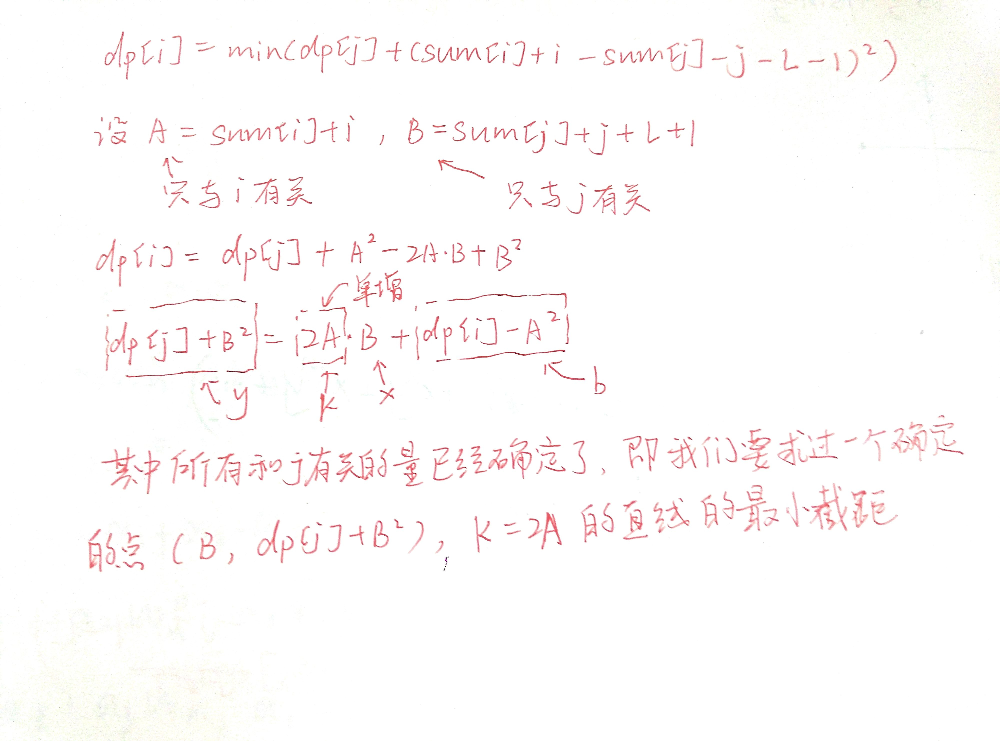

# 斜率优化

$dp[i]=min(dp[j]+(sum[i]+i−sum[j]−j−L−1)2),i>j$


```c++
#include<iostream>
#include<cstdio>
#include<cmath>
#define maxn 50005
#define ll long long
using namespace std;
int q[maxn];
double A[maxn],B[maxn],dp[maxn],sum[maxn];
double X(int x){return B[x];}
double Y(int x){return dp[x]+B[x]*B[x];}
double slope(int a,int b){return (Y(a)-Y(b))/(X(a)-X(b));}
int main()
{
	int n,l;cin>>n>>l;
	for(int i=1;i<=n;i++)scanf("%lf",&sum[i]);
	for(int i=1;i<=n;i++)
	{
		sum[i]+=sum[i-1];
		A[i]=sum[i]+i;B[i]=sum[i]+i+l+1;
	}
	B[0]=l+1;//B[0]=sum[0]+0+l+1=l+1
	int tail=1,head=1;
	for(int i=1;i<=n;i++)
	{
		while(head<tail&&slope(q[head],q[head+1])<2*A[i])head++;
		int j=q[head];dp[i]=dp[j]+(A[i]-B[j])*(A[i]-B[j]);
        //why:dp[j]+B^2=2*A*B-A^2+dp[i];
		//    dp[i]=dp[j]+A^2+B^2-2*A*B=dp[j]+(A-B)(A-B)
		while(head<tail&&slope(i,q[tail-1])<slope(q[tail-1],q[tail]))tail--;
		q[++tail]=i;
	}
	printf("%lld",(ll)dp[n]);
	return 0;
}


```


```c++
#include<bits/stdc++.h>
using namespace std;
typedef long long ll;
const int N=1e5+9;
const int mod=1e9+7;
ll read(){
	ll ans=0,f=1;
	char c=getchar();
	while(c>'9'||c<'0'){
		if(c=='-')f=-1;
		c=getchar();
	}
	while(c<='9'&&c>='0'){
		ans=(ans<<3)+(ans<<1)+c-'0';
		c=getchar();
	}
	return ans*f; 
}
int n,m,ppp;
ll a[N],sum[N],d[N];
ll f[101][N];
struct Point{
	ll x,y;
	Point(ll _x=0,ll _y=0){
		x=_x;y=_y;
	}
	Point operator-(const Point a)const{
		return Point(x-a.x,y-a.y);
	}
	Point operator+(const Point a)const{
		return Point(x+a.x,y+a.y);
	}
	ll operator^(const Point a)const{
		return x*a.y-y*a.x;
	}
}p[N];


ll jud(int a,int b,int c){
	return (p[b]-p[a])^(p[c]-p[a]);
}
int now;
ll Y(int k){
	return sum[k]+f[now][k];
}

ll cul(int x,int k){
	return Y(x)-a[k]*x;
}


int hd,tl,q[N];
void solv(){
	n=read(),m=read(),ppp=read();
	for(int i=2;i<=n;i++){
		d[i]=d[i-1]+read();
	}
	for(int i=1;i<=m;i++){
		int id=read(),tim=read();
		a[i]=tim-d[id];
	}
	sort(a+1,a+1+m);
	for(int i=1;i<=m;i++){
		sum[i]=sum[i-1]+a[i];
	}
	for(int i=1;i<=m;i++){
		f[1][i]=i*a[i]-sum[i];
	}
	ll ans=f[1][m];
	for(int i=2;i<=ppp;i++){
		tl=0,hd=1;
		q[++tl]=0;
		now=i-1;
		for(int j=1;j<=m;j++){
			
			p[j].x=j;p[j].y=f[i-1][j]+sum[j];
			while(hd<tl&&cul(q[hd],j)>cul(q[hd+1],j)){
				hd++;
			}
			
			int k=q[hd];
			f[i][j]=f[i-1][k]-sum[j]+sum[k]+a[j]*(j-k);
			while(hd<tl&&jud(q[tl-1],q[tl],j)<=0){
				tl--;
			}
			
			q[++tl]=j;
		}
		ans=min(ans,f[i][m]);
	}
	printf("%lld\n",ans);
}

int main(){
	int tst=1;
	while(tst--){
		solv();
	} 
	return 0;
}

```
# 二维数点

给出一个二维平面內的若干个点，多次询问某个矩形区域內包含多少个点（边界也算）。又或者，给一个长为 n 的序列，多次询问区间 [ l , r ]  中值在 [ x , y ]  内的元素个数。


二维偏序:
 

1.将所有点按横坐标排序
2.将所有矩形询问拆成四个区域，即四次询问，所有询问按 x 轴排序
3.遍历询问，设当前横坐标为 x，保证 x ′ ≤ x 的所有点的纵坐标已加入树状数组，在树状数组中查询答案，贡献加至原询问处
4.输出每个原询问的答案

运用CDQ分治可解决更高维的偏序问题


## [SHOI2007] 园丁的烦恼
第一行有两个整数 $n, m$，分别表示树木个数和询问次数。

接下来 $n$ 行，每行两个整数 $x, y$，表示存在一棵坐标为 $(x, y)$ 的树。有可能存在两棵树位于同一坐标。

接下来 $m$ 行，每行四个整数 $a, b, c, d$，表示查询以 $(a, b)$ 为左下角，$(c, d)$ 为右上角的矩形内部（包括边界）有多少棵树。

```c++
int n,m;
int c[N];
int number[N*5],numbernum;
void add(int pos,int k){
	for(int i=pos;i<=numbernum;i+=i&-i)c[i]+=k;
}
int query(int pos){
	int ans=0;
	while(pos){
		ans+=c[pos];
		pos-=pos&-pos;
	}
	return ans;
}
struct Point{
	int id,w;
	int x,y;
	bool operator<(const Point a)const{
		if(x!=a.x)return x<a.x;
		return id<a.id;
	}
}p[N*5];
int ans[N];
int pnum;
void addp(int x,int y,int id,int w){
	p[++pnum].x=x;
	p[pnum].y=y;
	p[pnum].id=id;
	p[pnum].w=w;
}

void solv(){
	cin>>n>>m;
	pnum=n;
	for(int i=1;i<=n;i++){
		cin>>p[i].x>>p[i].y;
		p[i].x++;p[i].y++;
		number[++numbernum]=p[i].y;
	}
	for(int i=1;i<=m;i++){
		int a,b,c,d;
		cin>>a>>b>>c>>d;
		a++,b++,c++,d++;
		number[++numbernum]=b-1;
		number[++numbernum]=d;
		addp(a-1,b-1,i,1);
		addp(a-1,d,i,-1);
		addp(c,b-1,i,-1);
		addp(c,d,i,1);
		
	}
	sort(number+1,number+1+numbernum);
	numbernum=unique(number+1,number+1+numbernum)-number-1;
	sort(p+1,p+1+pnum);
	for(int i=1;i<=pnum;i++){
		if(p[i].id==0){
			int pos=lower_bound(number+1,number+1+numbernum,p[i].y)-number;
			add(pos,1);
		}else{
			int pos=lower_bound(number+1,number+1+numbernum,p[i].y)-number;
			ans[p[i].id]+=p[i].w*query(pos);
		}
	}
	for(int i=1;i<=m;i++){
		cout<<ans[i]<<'\n';
	}
}
```


# 逆序对
归并排序
O(nlongn)
```c++

ll cul(int c[],int l,int r){
	if(l==r)return 0;
	int mid=l+r>>1;
	int i=l,j=mid+1;
	int k=l-1;
	ll ans=cul2(c,l,mid)+cul2(c,mid+1,r);
	while(i<=mid&&j<=r){
		if(c[i]<=c[j]){
			tmp[++k]=c[i];
			i++;
		}else{
			tmp[++k]=c[j];
			j++;
			ans+=mid-i+1;
		}
	}
	while(i<=mid){
		tmp[++k]=c[i];
		i++;
	}
	while(j<=r){
		tmp[++k]=c[j];
		j++;
	}
	
	for(int i=l;i<=r;i++){
		c[i]=tmp[i];
	}
	
	return ans;
	
}

```
# 2-Sat

① a = 1, a0 → a1
 &nbsp;&nbsp; &nbsp; a = 0, a1 → a0
② a & b = 1, a0 → a1 , b0 → b1
 &nbsp;&nbsp; &nbsp; a & b = 0, a1 → b0 , b1 → a0
③ a ∣ b = 1, a0 → b1 , b0 → a1
 &nbsp;&nbsp; &nbsp; a ∣ b = 0, a1 → a0 , b1 → b0
④ a ⊕ b = 1, a0 → b1 , a1 → b0 , b0 → a1 , b1 → a0
 &nbsp;&nbsp; &nbsp; a ⊕ b = 0, a0 → b0 , a1 → b1 , b0 → a0 , b1 → a1

```c++
struct TwoSat {
    int n;
    std::vector<std::vector<int>> e;
    std::vector<bool> ans;
    TwoSat(int n) : n(n), e(2 * n), ans(n) {}
    void addClause(int u, bool f, int v, bool g) {
        e[2 * u + !f].push_back(2 * v + g);
        e[2 * v + !g].push_back(2 * u + f);
    }
    bool satisfiable() {
        std::vector<int> id(2 * n, -1), dfn(2 * n, -1), low(2 * n, -1);
        std::vector<int> stk;
        int now = 0, cnt = 0;
        std::function<void(int)> tarjan = [&](int u) {
            stk.push_back(u);
            dfn[u] = low[u] = now++;
            for (auto v : e[u]) {
                if (dfn[v] == -1) {
                    tarjan(v);
                    low[u] = std::min(low[u], low[v]);
                } else if (id[v] == -1) {
                    low[u] = std::min(low[u], dfn[v]);
                }
            }
            if (dfn[u] == low[u]) {
                int v;
                do {
                    v = stk.back();
                    stk.pop_back();
                    id[v] = cnt;
                } while (v != u);
                ++cnt;
            }
        };
        for (int i = 0; i < 2 * n; ++i) if (dfn[i] == -1) tarjan(i);
        for (int i = 0; i < n; ++i) {
            if (id[2 * i] == id[2 * i + 1]) return false;
            ans[i] = id[2 * i] > id[2 * i + 1];
        }
        return true;
    }
    std::vector<bool> answer() { return ans; }
};

```


# 下一个序列号
当前序列不存在下一个排列时，函数返回false，否则返回true
next_permutation（node,node+n,cmp）可以对结构体num按照自定义的排序方式cmp进行排序。
```c++
	for(int i=1;i<=4;i++)id[i]=i;
	ll ans=jud();
	while(next_permutation(id+1,id+5)){
		ans=min(ans,jud());
	}
```

```c++
//'A'<'a'<'B'<'b'<...<'Z'<'z'.
int cmp(char a,char b) {
    if(tolower(a)!=tolower(b))//tolower 是将大写字母转化为小写字母.
        return tolower(a)<tolower(b);
    else return a<b;
}


do{
    printf("%s\n",ch);
    while(next_permutation(ch,ch+strlen(ch),cmp));
}
```


# 黑科技
## 吸氧
```c++
#pragma GCC optimize(2)
```

```c++
#pragma GCC optimize(3,"Ofast","inline")
```

```c++
void checkTime() {
    if (cnt++==100) {
        cnt = 0;
        if ((long double) clock() / CLOCKS_PER_SEC > 3.0) {
            flag = true;
        }
    }
}

```

```c++
#include <bits/stdc++.h>
using namespace std;
int main(){
	while(1){
		system("random>in.in");
		system("ans<in.in>ans.ans");
		system("my<in.in>my.my");
		if(system("FC ans.ans my.my"))break;
	}
}
```

## 手写堆
```c++
struct Heap{
	ll q[N], cnt;
	void pushup(int id) {
		while (id > 1) {
			if (q[id] >= q[id >> 1]) break;
			swap(q[id], q[id >> 1]);
			id >>= 1;
		}
	}
	void movedown() {
		int id = 1;
		while (id << 1 <= cnt) {
			if ((id << 1 | 1) <= cnt) {
				if (q[id] < min(q[id << 1], q[id << 1 | 1])) break;;
				if (q[id << 1] < q[id << 1 | 1]) swap(q[id], q[id << 1]), id <<= 1;
				else swap(q[id], q[id << 1 | 1]), id = id << 1 | 1;
			}
			else {
				if (q[id] > q[id << 1]) swap(q[id], q[id << 1]);
				break;
			}
		}
	}
	void push(ll x) {
		q[++cnt] = x;
		pushup(cnt);
	}
	void pop() {
		swap(q[1], q[cnt]);
		cnt--;
		movedown();
	}
	ll top(){
		return q[1];
	}
}pq;
```


## BM算法 线性递推


```c++
#include<bits/stdc++.h>
using namespace std;

namespace linear_seq {
	#define rep(i,a,n) for (int i=a;i<n;i++)
	#define per(i,a,n) for (int i=n-1;i>=a;i--)	
	#define pb push_back
	#define mp make_pair
	#define all(x) (x).begin(),(x).end()
	#define fi first
	#define se second
	#define SZ(x) ((int)(x).size())
	typedef vector<int> VI;
	typedef pair<int,int> PII;
	typedef long long ll;
	const ll mod=1e9+7;
    const int N=10010;
    ll res[N],base[N],_c[N],_md[N];
 	ll modpow(ll a,ll b,ll mod) {ll res=1;a%=mod; for(;b;b>>=1){if(b&1)res=res*a%mod;a=a*a%mod;}return res;}
    vector<int> Md;
    void mul(ll *a,ll *b,int k) {
        rep(i,0,k+k) _c[i]=0;
        rep(i,0,k) if (a[i]) rep(j,0,k) _c[i+j]=(_c[i+j]+a[i]*b[j])%mod;
        for (int i=k+k-1;i>=k;i--) if (_c[i])
            rep(j,0,SZ(Md)) _c[i-k+Md[j]]=(_c[i-k+Md[j]]-_c[i]*_md[Md[j]])%mod;
        rep(i,0,k) a[i]=_c[i];
    }
    int solve(ll n,VI a,VI b) { // a 系数 b 初值 b[n+1]=a[0]*b[n]+...
//        printf("%d\n",SZ(b));
        ll ans=0,pnt=0;
        int k=SZ(a);
       // assert(SZ(a)==SZ(b));
        rep(i,0,k) _md[k-1-i]=-a[i];_md[k]=1;
        Md.clear();
        rep(i,0,k) if (_md[i]!=0) Md.push_back(i);
        rep(i,0,k) res[i]=base[i]=0;
        res[0]=1;
        while ((1ll<<pnt)<=n) pnt++;
        for (int p=pnt;p>=0;p--) {
            mul(res,res,k);
            if ((n>>p)&1) {
                for (int i=k-1;i>=0;i--) res[i+1]=res[i];res[0]=0;
                rep(j,0,SZ(Md)) res[Md[j]]=(res[Md[j]]-res[k]*_md[Md[j]])%mod;
            }
        }
        rep(i,0,k) ans=(ans+res[i]*b[i])%mod;
        if (ans<0) ans+=mod;
        return ans;
    }
    VI BM(VI s) {
        VI C(1,1),B(1,1);
        int L=0,m=1,b=1;
        rep(n,0,SZ(s)) {
            ll d=0;
            rep(i,0,L+1) d=(d+(ll)C[i]*s[n-i])%mod;
            if (d==0) ++m;
            else if (2*L<=n) {
                VI T=C;
                ll c=mod-d*modpow(b,mod-2,mod)%mod;
                while (SZ(C)<SZ(B)+m) C.pb(0);
                rep(i,0,SZ(B)) C[i+m]=(C[i+m]+c*B[i])%mod;
                L=n+1-L; B=T; b=d; m=1;
            } else {
                ll c=mod-d*modpow(b,mod-2,mod)%mod;
                while (SZ(C)<SZ(B)+m) C.pb(0);
                rep(i,0,SZ(B)) C[i+m]=(C[i+m]+c*B[i])%mod;
                ++m;
            }
        }
        return C;
    }
    int gao(VI a,ll n) {
        VI c=BM(a);
        c.erase(c.begin());
        rep(i,0,SZ(c)) c[i]=(mod-c[i])%mod;
        return solve(n,c,VI(a.begin(),a.begin()+SZ(c)));
    }
};

int main(){
	int n;
	while (~scanf("%d",&n)) {
    	vector<int>v;
        v.push_back(1);
        v.push_back(2);
        v.push_back(4);
        v.push_back(7);
        v.push_back(13);
        v.push_back(24);
        //VI{1,2,4,7,13,24}
        printf("%d\n",linear_seq::gao(v,n-1));
	}
	return 0;
}
```


